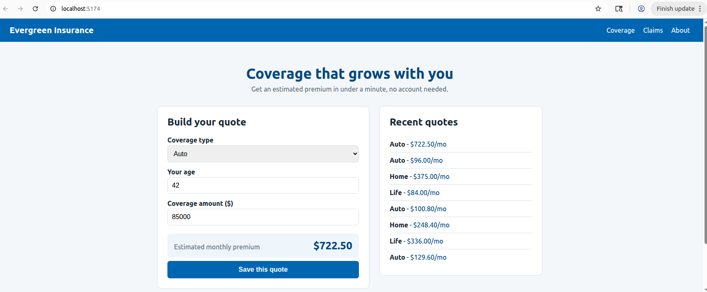

# Delivery Review: Evergreen Quote Phase 2
**Delivery Lead**: Kristen Marturano **Week of:** 2026-08-31

## Slide 1: Delivery goal & did we hit it?

- Goal (one sentence): By Thursday EOD, the assembled, typed, data-loading Evergreen Quote React app is merged to main via a reviewed PR with a green CI run, with type-check and production build passing.
- Hit? X Yes  ☐ Partially  ☐ No
- Merged to main via PR #10 with green CI; type-check and production build both passing.

## Slide 2: What shipped

- Live premium estimate that recalculates as the customer types.
- Product title + sponsor's approved rates configured (auto 85/ home 130/ life 65).
- QA-flagged type bug caught by the compiler and fixed.
- Recent quotes load from a data feed with loading/error/success states.
- Custom hook + context provider dropped in, no behavior change, unlocked "Save this Quote".
- Merged to main with a green production build.

## Slide 3: Two key decisions

1. **Deferred the ZIP-code field** to next round. It touches every layer of the typed app (data -> form -> pricing -> saved records), so it's a multi-part change, not a one-line add, rushing it would have risked Thursday's green build.
2. **Shipped this week on the flagged toolchain.** The dependency flag was ina  development-time tool, not in anything customers download, and the upgrade is scheduled for the platform team's window next week, so shipping was safe.

## Slide 4: Risks & injects

- Kept a risk register of 6 risks (owner/likelihood/impact/mitigation/trigger).
- **Inject #1 (ZIP field + flagged dependency):** re-prioritized the board, wrote a decision memo, and sent the sponsor a status update with a clear ship/hold call.
- **Inject #2 (red main + a $3,120 bad quote):** routed it as a leader, named what I observed, asked a specific owner a specific question, and made a **NO-GO** call: my branch was green, but I would not merge onto a red, mispricing main. Merged once main was healthy.

## Slide 5: What I'd do differently next round

- Push for rate values to live in a validated data file, so a bad rate is caught before it ships (directly from this week's home-rate incident).
- Add a CI step that sanity-checks premium *values*, not just types, the type-check proved it catches shape but not correctness (my Copilot critique showed the same gap).
-Add done-criteria to every board issue up front, not just the first few.

## Q&A prep: likely questions

- Your branch was green, why not just merge and fix 'main' after?
- Why defer the ZIP-code field instead of "just adding the box"?
- Was it safe to ship on the flagged dependency?
- If CI passed, how did a wrong number reach a customer?

